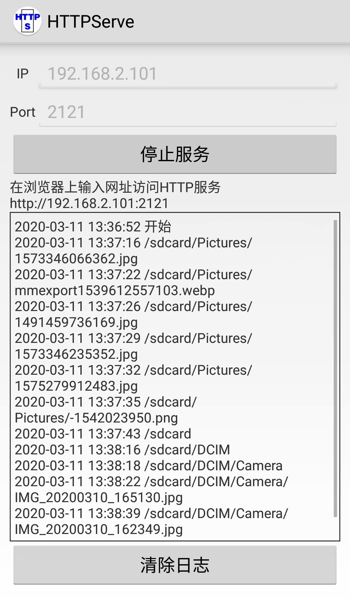
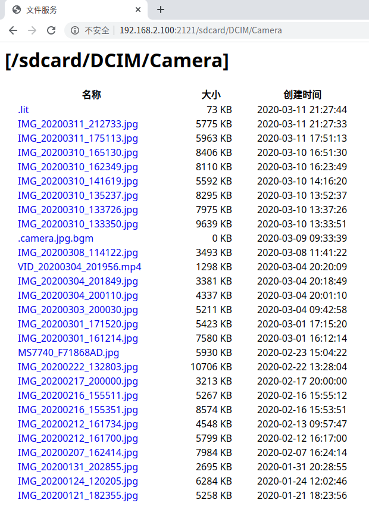

# Android：HTTP Serve
使用 httpcore 库，在手机上开启HTTP服务，局域网设备可以使用浏览器通过IP地址访问手机文件。
### 参考
[目录列表和文件查看（我优化了目录排版，增加了文件按日期倒序排列，用从文件名获取MIME替代自定义MIME，增加端口设置和服务启停，增加日志）](https://github.com/gpfduoduo/HttpServerOnAndroid)  
[最简框架（他把几个类写在一个文件里，我分离了）](https://blog.csdn.net/jkeven/article/details/9271145)
### 服务端

### 客户端
